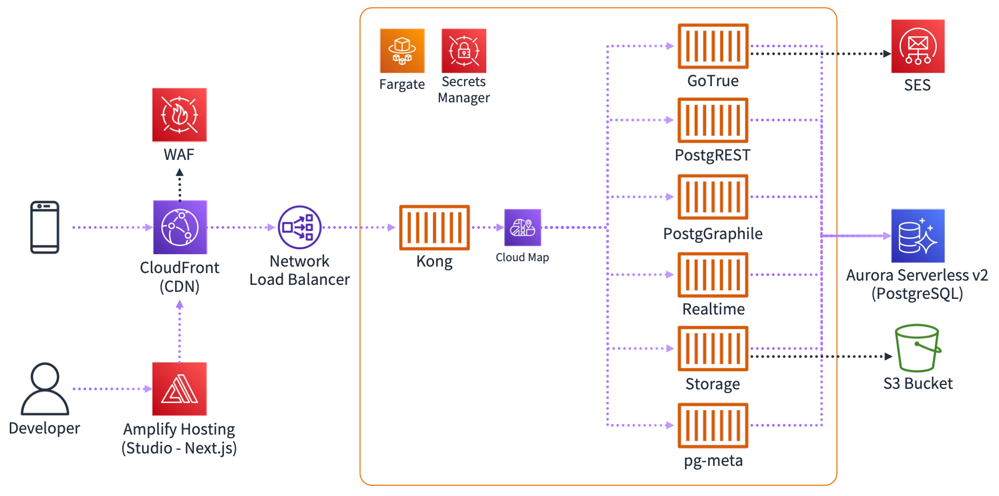

# Supabase on AWS



## Deploy via CloudFormation template

| Region | View | Stable | Latest |
|:--|:--|:--|:--|
| US East (N. Virginia) | [View](https://supabase-on-aws-us-east-1.s3.amazonaws.com/latest/Supabase.template.json) | [][stable-us-east-1] | [][us-east-1] |
| US West (Oregon) | [View](https://supabase-on-aws-us-west-2.s3.amazonaws.com/latest/Supabase.template.json) | [][stable-us-west-2] | [][us-west-2] |
| Europe (Ireland) | [View](https://supabase-on-aws-eu-west-1.s3.amazonaws.com/latest/Supabase.template.json) | [][stable-eu-west-1] | [][eu-west-1] |
| Asia Pacific (Tokyo) | [View](https://supabase-on-aws-ap-northeast-1.s3.amazonaws.com/latest/Supabase.template.json) | [][stable-ap-northeast-1] | [][ap-northeast-1] |
| Asia Pacific (Singapore) | [View](https://supabase-on-aws-ap-southeast-1.s3.amazonaws.com/latest/Supabase.template.json) | [][stable-ap-southeast-1] | [][ap-southeast-1] |
| Asia Pacific (Sydney) | [View](https://supabase-on-aws-ap-southeast-2.s3.amazonaws.com/latest/Supabase.template.json) | [][stable-ap-southeast-2] | [][ap-southeast-2] |

[stable-us-east-1]: https://us-east-1.console.aws.amazon.com/cloudformation/home#/stacks/create/review?stackName=Supabase&templateURL=https://supabase-on-aws-us-east-1.s3.amazonaws.com/stable/Supabase.template.json&param_SesRegion=us-east-1
[stable-us-west-2]: https://us-west-2.console.aws.amazon.com/cloudformation/home#/stacks/create/review?stackName=Supabase&templateURL=https://supabase-on-aws-us-west-2.s3.amazonaws.com/stable/Supabase.template.json&param_SesRegion=us-west-2
[stable-eu-west-1]: https://eu-west-1.console.aws.amazon.com/cloudformation/home#/stacks/create/review?stackName=Supabase&templateURL=https://supabase-on-aws-eu-west-1.s3.amazonaws.com/stable/Supabase.template.json&param_SesRegion=eu-west-1
[stable-ap-northeast-1]: https://ap-northeast-1.console.aws.amazon.com/cloudformation/home#/stacks/create/review?stackName=Supabase&templateURL=https://supabase-on-aws-ap-northeast-1.s3.amazonaws.com/stable/Supabase.template.json&param_SesRegion=ap-northeast-1
[stable-ap-southeast-1]: https://ap-southeast-1.console.aws.amazon.com/cloudformation/home#/stacks/create/review?stackName=Supabase&templateURL=https://supabase-on-aws-ap-southeast-1.s3.amazonaws.com/stable/Supabase.template.json&param_SesRegion=ap-southeast-1
[stable-ap-southeast-2]: https://ap-southeast-2.console.aws.amazon.com/cloudformation/home#/stacks/create/review?stackName=Supabase&templateURL=https://supabase-on-aws-ap-southeast-2.s3.amazonaws.com/stable/Supabase.template.json&param_SesRegion=ap-southeast-2

[us-east-1]: https://us-east-1.console.aws.amazon.com/cloudformation/home#/stacks/create/review?stackName=Supabase&templateURL=https://supabase-on-aws-us-east-1.s3.amazonaws.com/latest/Supabase.template.json&param_SesRegion=us-east-1
[us-west-2]: https://us-west-2.console.aws.amazon.com/cloudformation/home#/stacks/create/review?stackName=Supabase&templateURL=https://supabase-on-aws-us-west-2.s3.amazonaws.com/latest/Supabase.template.json&param_SesRegion=us-west-2
[eu-west-1]: https://eu-west-1.console.aws.amazon.com/cloudformation/home#/stacks/create/review?stackName=Supabase&templateURL=https://supabase-on-aws-eu-west-1.s3.amazonaws.com/latest/Supabase.template.json&param_SesRegion=eu-west-1
[ap-northeast-1]: https://ap-northeast-1.console.aws.amazon.com/cloudformation/home#/stacks/create/review?stackName=Supabase&templateURL=https://supabase-on-aws-ap-northeast-1.s3.amazonaws.com/latest/Supabase.template.json&param_SesRegion=ap-northeast-1
[ap-southeast-1]: https://ap-southeast-1.console.aws.amazon.com/cloudformation/home#/stacks/create/review?stackName=Supabase&templateURL=https://supabase-on-aws-ap-southeast-1.s3.amazonaws.com/latest/Supabase.template.json&param_SesRegion=ap-southeast-1
[ap-southeast-2]: https://ap-southeast-2.console.aws.amazon.com/cloudformation/home#/stacks/create/review?stackName=Supabase&templateURL=https://supabase-on-aws-ap-southeast-2.s3.amazonaws.com/latest/Supabase.template.json&param_SesRegion=ap-southeast-2

### Specification and Limitation

- API
  - All containers run on ECS Fargate (Graviton2).
    - Only Storage API run on x86 pratform.
  - All containers are allocated 1 vCPU/2GB memory.
  - All components are configured with AutoScaling.
    - Only Realtime API does not autoscale
  - GraphQL is not supported, because [pg_graphql](https://github.com/supabase/pg_graphql) is not supported with Amazon RDS/Aurora.
    - You can enable GraphQL using [PostGraphile](https://www.graphile.org/postgraphile/) via CDK.
- Database
  - Use [Aurora Serverless v2](https://aws.amazon.com/rds/aurora/serverless/).
  - DB password will be rotated automatically every 30 days.
- Service Discovery
  - Use [Cloud Map](https://aws.amazon.com/cloud-map/) as internal DNS.
    - Each component is discovered as `***.supabase.local`.
  - By default, [App Mesh](https://aws.amazon.com/app-mesh/) is used as service mesh.
    - You can disable App Mesh via CDK.
- Studio
  - You can use authentication using Cognito UserPool.
    - Need to set certificate ARN.
    - By default, use http without authentication.

## Deploy via CDK

```bash
git clone https://github.com/mats16/supabase-on-aws.git

cd supabase-on-aws

yarn install

cdk deploy Supabase
```
