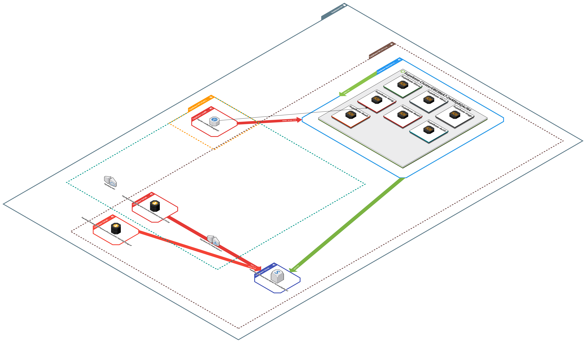

# Itsware Hosted Supabase on AWS - CloudFormation/CDK Template

This repo includes a modified template of a starting Supabase stack on AWS via CloudFormation/CDK. This template uses the following managed services:
- Route53 
- AWS ECS
- AWS Aurora
- AWS ECR
- AWS ALB
- AWS Amplify
- Cloudfront
- AWS Certificate Manager
- AWS WAF and Shield
- AWS Backup
- AWS Lambda
- AWS S3

## Architecture



### Specifications and Limitations (taken from original [README](./README_Community_Supabase.md)

- APIs
  - All containers run on ECS Fargate (Graviton2).
  - All components are configured with AutoScaling.
  - GraphQL is not supported, because [pg_graphql](https://github.com/supabase/pg_graphql) is not supported with Amazon RDS/Aurora.
- Service Discovery
  - Each component is discovered as `***.supabase.internal`.
- Database (PostgreSQL)
  - [Amazon Aurora Serverless v2](https://aws.amazon.com/rds/aurora/serverless/) is used.
  - Todo: Add automatically password rotation.
- Supabase Studio
  - It is deployed on [Amplify Hosting](https://aws.amazon.com/amplify/hosting/).
  - Todo: Add option to deploy the studio in different regions.
  - ⚠️ Warning: Supabase Studio is **open to web** and can be accessed by malicious actors. We **strongly** suggest you active ['Access control'](https://docs.aws.amazon.com/amplify/latest/userguide/access-control.html) globaly and setup a strong password and username.


### Itsware Specific Modifications to Base Supabase CDK deploy

- Route53
  - Alias added for studio.itsware.com (Supabase Studio Dashboard) [Manually done through the dashboard].
  - Alias added for supabase.itsware.com (Supabase Backend Services) [Manually done through the dashboard].
  - Healthchecks added for both endpoints. **NOTE** Due to auth protection being in place for each endpoint, the health checks use an inverted check , so that a 401 from each is proof of liveness [Manually done through the dashboard].
- Cloudfront
  - Alternate domain of supabase.itsware.com added to allow for Kong reverse proxy to accept requests from clients that use this endpoint when making Supabase REST calls [Manually done through the dashboard].
- AWS Amplify
  - HTTPS domain of studio.itsware.com added to allow developers to access the Supabase dashboard using a vanity domain instead of the autogenerated one [Manually done through the dashboard].
- AWS Aurora
  - Created a new VPC and subnet group for us-west for the replicas to be created
  - Aurora Postgres does not support cross-region read replicas.
  - Regional Cluster [Deployed via CDK] was converted into a Global Cluster [Manually done through the dashboard]
  - The read replica setup requires the replica to be instanced in more than one region , so that is why there are 2 instances in us-west instead of 1
- AWS Backup
  - This was turned on and configured for all Supabase resources [Manually done through the dashboard]
- Supabase Studio
  - A modification was made in the build process for Studio that forces the version of npm that is laid down in the environment to match the required version.

## Deploy via CDK

- Prerequisites
  - Install and configure [CDK](https://docs.aws.amazon.com/cdk/v2/guide/getting_started.html)
  - Configure [AWS SSO tokens](https://docs.aws.amazon.com/cli/latest/userguide/sso-configure-profile-token.html)

```bash
git clone https://github.com/itsware-inc/supabase-on-aws.git

cd supabase-on-aws

yarn install

cdk deploy Supabase
```

## Upgrades via CDK

The upgrade/downgrade process should consist of the execution of a CDK deploy line in the CLI that has the following format

```bash
cdk deploy Supabase --profile AdministratorAccess-500251631311 --parameters Supabase:AuthImageUri='public.ecr.aws/supabase/gotrue:v2.152.1' Supabase:RestImageUri='public.ecr.aws/supabase/postgrest:v12.1' Supabase:RealtimeImageUri='public.ecr.aws/supabase/realtime:v2.29.5' Supabase:StorageImageUri='public.ecr.aws/supabase/storage-api:v1.3.1' Supabase:public.ecr.aws/supabase/imgproxy:ImgproxyImageUri='public.ecr.aws/supabase/imgproxy:v1.2.0' Supabase:PostgresMetaImageUri='public.ecr.aws/supabase/postgres-meta:v0.81.1'
```

Through different variations of the call above, I was unable to provide parameter overrides from the CLI without directly modifying the version strings in the following block of URI definitions that can be found here in the [supabase repo](https://github.com/itsware-inc/supabase-on-aws/blob/b62a6bffc53e12be05f3be7d1d3b396a3679c6ca/src/supabase-stack.ts#L97)

This upgrade methodology is brittle and , with proper modularization and a bit more research in terms of how the parameter override process works for deploying newer/older versions of the backend services for Supabase via CDK, it would be viable to simply provide the desired version of each ECR image from the Supbaase [ECR registry](https://gallery.ecr.aws/supabase)

One last note about the upgrade/downgrade process - Using CloudFormation via CDK is a bit risky , since the version drift (aka diff feature) for CDK is not robust enough for targeted deploys of parts of the architecture for Supabase. This could probably be solved with more modularization of the CDK stack for Supabase. Terraform would be a great alternative that allows for more flexibility in terms of upgrade/downgrade sequences and partial deploys of newer images for pieces of the deployed architecture.
